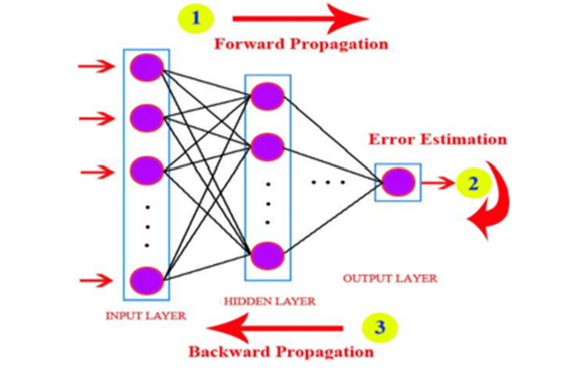

Trong phần trước, chúng ta đã tìm hiểu khá chi tiết về cấu trúc tổng thể của Blockchain. Ở phần này, chúng ta sẽ đi sâu hơn vào cách Blockchain được áp dụng cụ thể trong hệ thống Bitcoin.

# 💸 Giao dịch trong Bitcoin và sự khác biệt với giao dịch truyền thống

> *Không giống như giao dịch trong ngân hàng truyền thống — nơi bạn có số dư tài khoản (balance) và hệ thống sẽ cộng/trừ số dư (ghi nợ hoặc ghi có) — thì trong Bitcoin, việc giao dịch lại tuân theo nguyên tắc **chuyển quyền sở hữu tài sản**, giống như việc tiêu tiền giấy.*
> *Giả sử Alice chuyển Bitcoin cho Bob, tức là cô ấy **chuyển quyền sở hữu** số Bitcoin của mình cho Bob. Điều này tương tự như khi Alice đưa tờ tiền giấy thật cho Bob — quyền sở hữu đồng tiền được chuyển giao hoàn toàn. Việc chuyển quyền sở hữu này được gọi là **Transaction (giao dịch)**.*

# 🔁 Transaction

Ta vừa nói quá trình chuyển quyền sở hữu “tiền” điện tử gọi là **Transaction**.
Thực tế, một Transaction trong Bitcoin sẽ bao gồm **các inputs** và **các outputs**.

| Phía chi ra (Inputs) | Phía nhận vào (Outputs) |
| -------------------- | ----------------------- |
| Nơi tiền đến từ      | Nơi tiền đi đến         |

* **Inputs:** Là **các khoản tiền** bạn đang chi ra (những Bitcoin bạn sở hữu và muốn sử dụng).
* **Outputs:** Là nơi bạn gửi tiền đến — có thể là người khác, hoặc chính bạn (tiền thừa).

🔹 **Tổng giá trị input luôn lớn hơn hoặc bằng tổng giá trị output.**
Phần chênh lệch (input − output) = **phí giao dịch (transaction fee)**, được trả cho **thợ đào (miner)**.




## 🧠 [Góc kỹ thuật]

Một block trong blockchain sẽ được gom từ nhiều transaction.

**Cấu trúc của một block convert sang dạng json cơ bản như sau (thực tế là dạng nhị phân)**:

```json
{
  "block_header": {
    "version": 4,
    "previous_block_header_hash": "0000000000000000000213d29ef8f20387431e679b8a8b0c8b09335a113a37c1",
    "merkle_root_hash": "1b0847f9503dc033878b66792379d71c110609311029e2f51f50186937229e64",
    "time": 1636294726,
    "nBits": "170f3f50",
    "nonce": 1269450392
  },
  "txn_count": 2100,
  "transactions": [
    {
      "txid": "787c933682970724949539a6e133c2a6f528148b816a1e38a2095f9c968f86f3"
    },
    {
      "txid": "31f49d282e75e921d102e153b3425f12e84128f0802e9702202685040e9447e1"
    }
  ]
}
```

**Cấu trúc một Transaction tiêu biểu**

```json
{
  "transaction": {
    "version": 2,
    "vin_count": 1,
    "vin": [
      {
        "txid": "b1fea5249ac29e32d52bb9bcbf03c3ffae69f5c66bbb85848f2f9b8c8d4a7c43",
        "vout": 0,
        "scriptSig": {
          "asm": "3045...0221...01 0411db93e1dcdb8a016b49...",
          "hex": "483045022100f3...012103..."
        },
        "sequence": 4294967295
      }
    ],
    "vout_count": 2,
    "vout": [
      {
        "value": 1500000,
        "scriptPubKey": {
          "asm": "OP_DUP OP_HASH160 ab6803f2... OP_EQUALVERIFY OP_CHECKSIG",
          "hex": "76a914ab6803f2...88ac",
          "reqSigs": 1,
          "type": "pubkeyhash",
          "addresses": ["1A1zP1eP5QGefi2DMPTfTL5SLmv7DivfNa"]
        }
      },
      {
        "value": 484985000,
        "scriptPubKey": {
          "asm": "OP_DUP OP_HASH160 3fa13bc... OP_EQUALVERIFY OP_CHECKSIG",
          "hex": "76a9143fa13bc...88ac",
          "reqSigs": 1,
          "type": "pubkeyhash",
          "addresses": ["1FfmbHfnpaZjKFvyi1okTjJJusN455paPH"]
        }
      }
    ],
    "lock_time": 0,
    "txid": "4a5e1e4bdaa6c9f6b3b1f1a8d2b6b8e2a6f528148b816a1e38a2095f9c968f86"
  }
}
```

# 💰 Khái niệm UTXO

## UTXO là gì

Trong Bitcoin, “số dư” không được lưu trực tiếp như trong ngân hàng.
Thay vào đó, mạng duy trì danh sách các **đầu ra giao dịch chưa chi tiêu** — gọi là 👉 **UTXO (Unspent Transaction Output)**.
UTXO chính là **“đồng tiền” bạn đang sở hữu**, không có khái niệm “số dư”.

> Để tính số dư: chỉ cần cộng tất cả UTXO thuộc ví của bạn — giống như đếm số tờ tiền bạn có.

### 🧩 Kỹ thuật

Mỗi UTXO được định danh dưới dạng:

```
<transaction_id>:<output_index>
```

Khi bạn nhận Bitcoin → bạn nhận **một UTXO mới**.
Khi bạn gửi Bitcoin → bạn **tiêu (spend)** một hoặc nhiều UTXO cũ, đồng thời **tạo ra UTXO mới** cho người khác (và có thể “tiền thừa” cho chính bạn).

Ví của bạn thực chất là **danh sách các UTXO mà private key của bạn có quyền chi tiêu.**


## 🪙 Ví dụ minh họa

* Trường hợp 1: Tìm được UTXO đủ lớn để thanh toán.
  (Số dư đủ → có thể còn “tiền thừa”)
  

* Trường hợp 2: Gom nhiều UTXO nhỏ để đủ tổng tiền.
  

# 🔗 Transaction Chain

Các transaction có thể **nối với nhau**:
đầu ra của transaction trước (UTXO) → trở thành đầu vào của transaction sau.
Sau khi một transaction thực hiện, **các UTXO cũ bị tiêu**, và **UTXO mới được sinh ra**.


## ✅ Chứng minh quyền sở hữu UTXO

Để chứng minh quyền sở hữu các khoản tiền trong input, mỗi input phải chứa **chữ ký số (digital signature)** và **public key** của người gửi để xác nhận:

> “Tôi là người thực sự sở hữu Bitcoin này và tôi đồng ý chuyển nó.”

Bất kỳ ai cũng có thể **kiểm tra chữ ký** để xác minh giao dịch hợp lệ — bởi chỉ **người có private key** mới có thể tạo được chữ ký đúng.

> Vì vậy, “**Chi tiêu Bitcoin = Ký một giao dịch**” bằng private key của bạn.

### [Kỹ thuật]

```json
"vin": [
  {
    "txid": "b1fea5249ac29e32d52bb9bcbf03c3ffae69f5c66bbb85848f2f9b8c8d4a7c43",
    "vout": 0,
    "scriptSig": {
      "asm": "3045...0221...01 0411db93e1dcdb8a016b49...",
      "hex": "483045022100f3...012103..."
    },
    "sequence": 4294967295
  }
]
```

💡 Mỗi input có thể có **private key khác nhau**, nên dù ký cùng một transaction hash, **chữ ký vẫn khác nhau**.


# 🔄 Toàn bộ quá trình giao dịch diễn ra thế nào

1️⃣ **Alice tạo giao dịch (Construct Transaction)**
Ví của Alice chọn các UTXO phù hợp, tạo các đầu ra (cho Bob & tiền thừa), tính phí và ký bằng private key.

2️⃣ **Tạo các đầu ra (Outputs)**

* Output 1 → gửi cho Bob.
* Output 2 → trả lại Alice (tiền thừa).
  → Phần chênh lệch = phí giao dịch.

3️⃣ **Ký giao dịch (Sign Transaction)**
Mỗi input được ký bằng private key tương ứng.

4️⃣ **Phát tán giao dịch (Broadcast)**
Giao dịch được gửi lên mạng P2P → các node kiểm tra và lan truyền (gossip).


5️⃣ **Được đưa vào block (Mining)**
Miner chọn giao dịch hợp lệ, thêm vào block, giải thuật toán PoW.

6️⃣ **Bob nhận giao dịch (Verification)**
Ví Bob phát hiện output gửi tới địa chỉ mình → xác minh và hiển thị “Đã nhận”.

💡 **Tóm tắt 1 dòng:**

> *Alice ký → gửi → mạng lan truyền → miner ghi block → Bob nhận.*


# ⛏️ Bitcoin Mining – Quá trình đào và xác nhận giao dịch

Khi Alice gửi giao dịch, nó chưa nằm trong blockchain cho đến khi được **đưa vào block** thông qua quá trình **mining (đào)**.

## ⚙️ Bản chất của Mining

Bitcoin chống gian lận dựa trên **tính toán (computation)**.
Các giao dịch được gom thành **block**, mỗi block phải có một **header hợp lệ**, được tạo qua **Proof-of-Work (PoW)** — rất khó tìm ra nhưng dễ kiểm tra.

Mining phục vụ hai mục tiêu:

1. 🧩 **Đảm bảo tính hợp lệ:**
   Miner chỉ được thưởng nếu block hợp lệ → có động lực xác minh chính xác.

2. 💰 **Phát hành Bitcoin mới:**
   Mỗi block sinh ra lượng Bitcoin mới (block reward), giảm dần theo chu kỳ **halving** (~4 năm).


## 🪙 Phần thưởng của Miner

Miner tiêu tốn tài nguyên để giải bài toán hash.
Trung bình toàn mạng phải thử khoảng **10²³ lần hash** để tìm ra block hợp lệ.

Họ nhận được:

1. **Block Reward:** Bitcoin mới được sinh ra (qua coinbase transaction).
2. **Transaction Fees:** Tổng phí giao dịch trong block.

📘 **Công thức tổng quát:**

```
Miner Reward = Block Reward + Transaction Fees
```

> **Block Reward** giảm một nửa sau mỗi **210,000 block (~4 năm)** – gọi là **Halving**.
> Đến năm ~2140, phần thưởng khối = 0, miner chỉ sống bằng **phí giao dịch**.


## 🧩 Giao dịch của Alice được đưa vào block

Sau khi gửi, giao dịch của Alice nằm trong **mempool** (hàng chờ).
Miner ưu tiên chọn các giao dịch có **phí cao hơn**, kiểm tra hợp lệ rồi thêm vào block.

Khi block được đào thành công → giao dịch có **1 confirmation**.
Mỗi block mới nối thêm vào sẽ tăng số lượng xác nhận.

| Số lượng xác nhận | Mức độ an toàn              |
| ----------------- | --------------------------- |
| 1 block           | Có thể bị đảo ngược         |
| 3 blocks          | Khá an toàn                 |
| **6 blocks**      | Gần như không thể đảo ngược |

> ⚠️ **6 confirmations = Giao dịch được xem là “vĩnh viễn”.**
